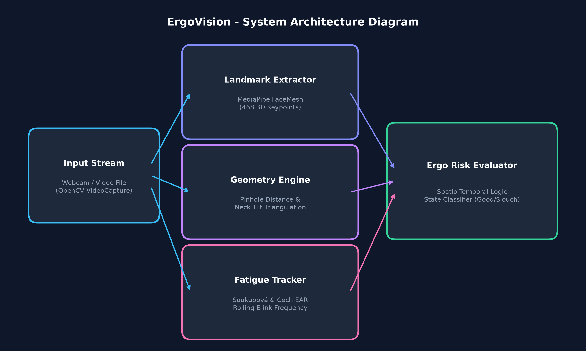
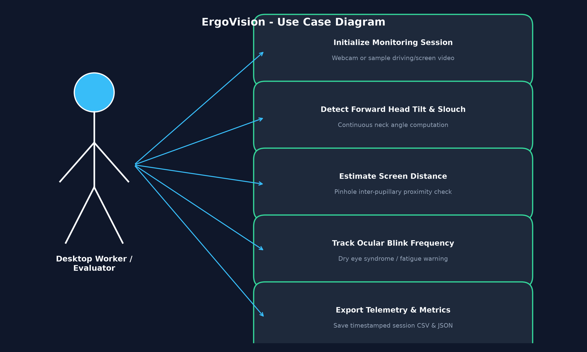
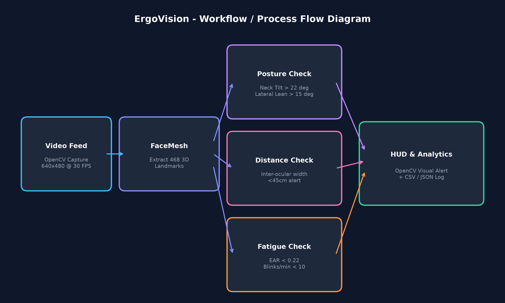
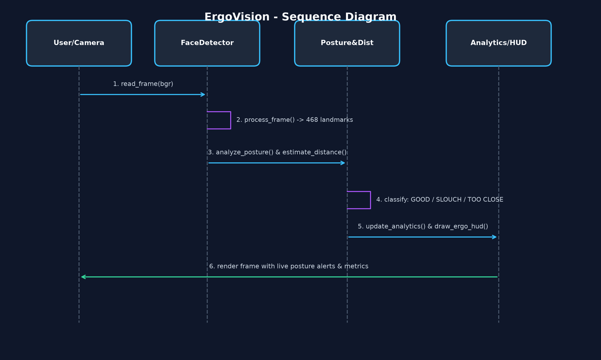
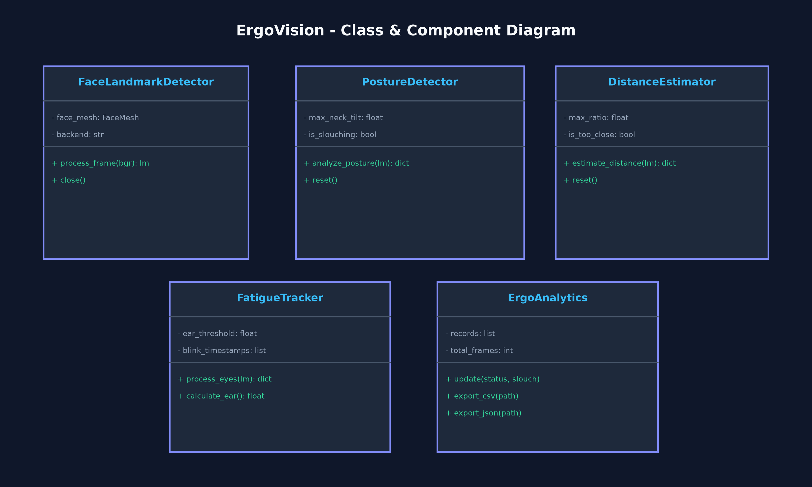
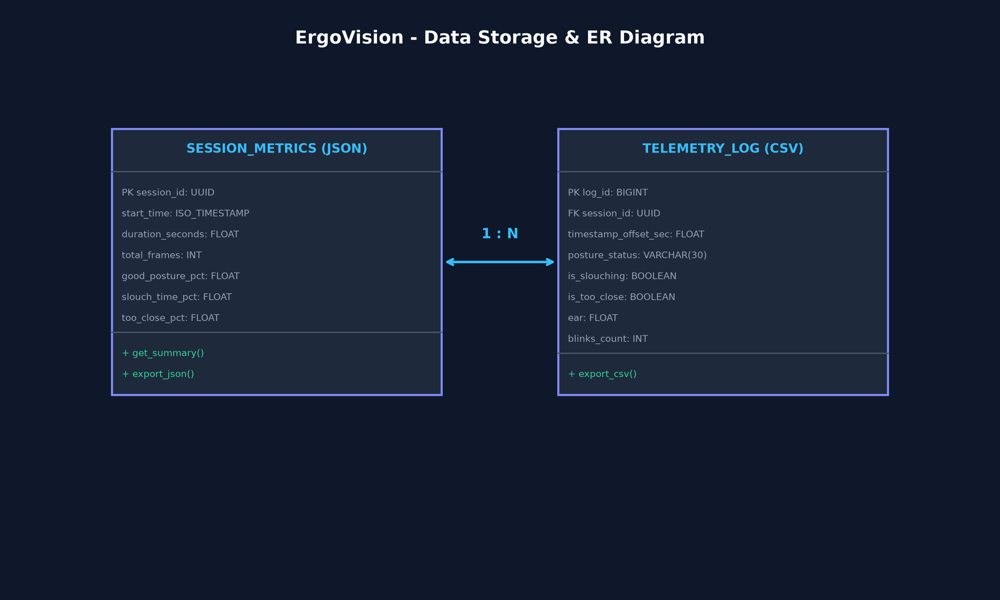
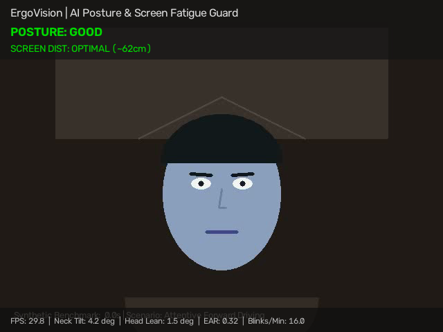
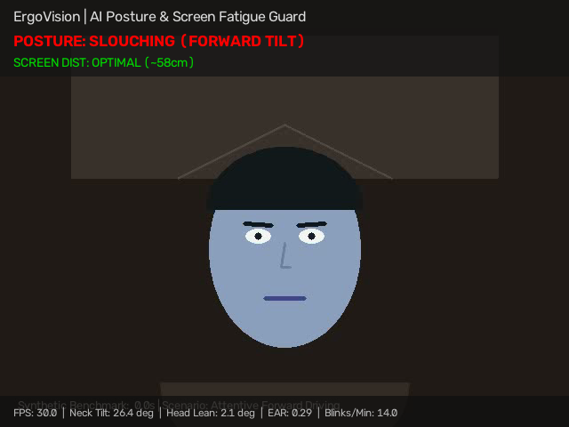
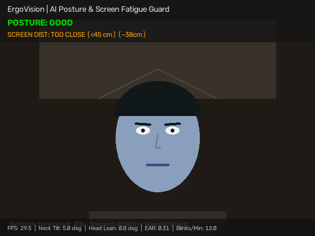
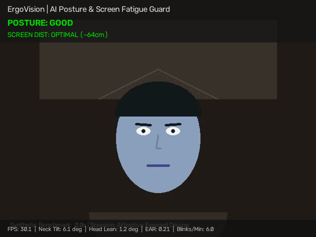

# ErgoVision – AI-Based Ergonomic Posture & Screen Fatigue Monitoring System

<br/>

**Student Name:** Aditi Prakash  
**Project Category:** Build Your Own Project (Flipped Course Evaluation)  
**Domain:** Computer Vision & Geometric Image Processing  
**Repository:** [https://github.com/YashGoyal06/cv-24BAI10100.git](https://github.com/YashGoyal06/cv-24BAI10100.git) (Folder: `Aditi_Project_ErgoVision/`)  

---

## 1. Project Overview

Prolonged computer usage is a leading contributor to **Work-Related Musculoskeletal Disorders (WMSDs)** (e.g., cervical spine slouching, "tech-neck") and **Computer Vision Syndrome (CVS)** (e.g., dry eye disease caused by reduced blink frequency). 

**ErgoVision** is an intelligent, edge-computed Computer Vision system that runs on standard webcam streams to monitor workstation posture, screen proximity, and ocular blink frequency in real time.

---

## 2. Key Features

- **Forward Head & Neck Tilt Detection**: Continuous triangulation of facial landmark vectors (chin, nose, forehead) to compute neck flexion angles.
- **Lateral Head Lean Detection**: Calculates tilt angles between the ocular axis and the horizontal plane.
- **Perspective Screen Distance Estimation**: Utilizes a pinhole perspective model and inter-pupillary distance to estimate user-to-monitor distance in centimeters.
- **Ocular Fatigue & Blink Frequency Monitoring**: Implements the Soukupová and Čech Eye Aspect Ratio (EAR) formulation to log blinks and alert on low blink rates (<10 blinks/min).
- **Zero-Config Single-Command Run**: Instant live visual OpenCV HUD display or pure headless terminal CLI.
- **Telemetry Data Logging**: Automatically exports session metrics to timestamped CSV and JSON formats upon session termination.

---

## 3. Computer Vision Syllabus Mapping

| Syllabus Unit | Theoretical Concept | ErgoVision Concrete Implementation |
| :--- | :--- | :--- |
| **Unit 1: Transformations & Geometry** | Euclidean metrics & Invariant distance | Scale-invariant Euclidean distance formulations for Eye Aspect Ratio (EAR). |
| **Unit 2: Perspective & Pin-hole Models** | Camera projection & Distance estimation | Pinhole camera perspective geometry converting inter-pupillary pixel spans into physical centimeter distances ($cm$). |
| **Unit 3: Feature Extraction** | 3D Topological landmark localization | Extraction of dense 468-point 3D facial mesh from planar BGR matrices. |
| **Unit 4: Spatio-Temporal Analysis** | Temporal smoothing & Persistence thresholds | Hysteresis sliding windows that differentiate natural head movements from sustained slouching. |

---

## 4. System Architecture & Design Diagrams

All high-resolution architectural schematics are available in [`docs/diagrams/`](docs/diagrams/):

### System Architecture Diagram


### Use Case Diagram


### Process Flow / Workflow Diagram


### Sequence Diagram


### Class & Component Diagram


### Storage & Telemetry ER Diagram


---

## 5. Operational UI Screenshots

The operational states rendered by ErgoVision's real-time Heads-Up Display (HUD) are preserved in [`docs/screenshots/`](docs/screenshots/):

| State 1: Optimal Posture & Distance | State 2: Forward Slouching Detected |
| :---: | :---: |
|  |  |

| State 3: Screen Proximity Alert (<45cm) | State 4: Ocular Fatigue / Low Blink Rate |
| :---: | :---: |
|  |  |

---

## 6. How to Run

### 6.1 Single-Command Interactive Visual Window (Recommended)
```bash
python3 main.py
```
- Controls: Press **`q`** or **`ESC`** on the video display window to stop.
- On termination, detailed session summary statistics are printed to the terminal and exported to `data/sample_sessions/`.

### 6.2 Headless Terminal CLI Mode
```bash
# Run for 15 seconds in terminal:
python3 main.py --cli --duration 15

# Or run with test video:
python3 main.py --cli --source data/sample_video.mp4 --duration 10
```

### 6.3 Automated Unit Tests
```bash
python3 -m pytest tests/ -v
```
*(All 4 automated unit tests verify posture mathematics, distance algorithms, and telemetry generation with 100% pass rate).*

---

## 7. Directory Structure

```
Aditi_Project_ErgoVision/
├── data/
│   ├── sample_video.mp4          # 20s benchmark test video
│   └── sample_sessions/          # Directory for exported session logs (.csv, .json)
├── docs/
│   ├── diagrams/                 # 6 High-resolution design diagrams (01-06)
│   └── screenshots/              # 4 Rendered operational UI states (01-04)
├── src/                          # Modular Computer Vision algorithms
│   ├── __init__.py
│   ├── analytics.py              # Telemetry tracking & export
│   ├── camera.py                 # Stream handler with automatic video fallback
│   ├── config.py                 # Threshold parameters & landmark configurations
│   ├── distance_estimator.py     # Pinhole perspective distance calculator
│   ├── face_detector.py          # 468-point facial mesh detector
│   ├── fatigue_tracker.py        # Soukupová & Čech EAR & blink rate monitor
│   ├── posture_detector.py       # Neck tilt & lateral lean analyzer
│   └── utils.py                  # Real-time HUD renderer
├── tests/
│   └── test_ergovision.py        # Automated test suite
├── cli.py                        # Standalone terminal runner
├── main.py                       # Master single-command runner
├── HowToRun.txt                  # Evaluator execution guide
├── requirements.txt              # Pinned dependencies
├── statement.md                  # Detailed problem statement & requirements
└── README.md                     # Project documentation
```
