<div align="center">

<br/>

# VisionGuard

### — AI-Based Driver Drowsiness and Distraction Detection System —

<br/>

[](https://python.org)
[](https://opencv.org)
[](https://developers.google.com/mediapipe)
[-brightgreen?style=flat-square&logo=pytest&logoColor=white)](https://pytest.org)

<br/>

```
  Facial Landmarks  ·  Eye Aspect Ratio  ·  Yawn Analysis  ·  3D Head Pose  ·  Risk Scoring
```

<br/>

</div>

---

## Quick Start (Single Command)

To run the complete system with live visual display and heads-up telemetry:

```bash
python3 main.py
```
*Press **`q`** or **`ESC`** on the video window to stop and view the session summary.*

---

## About the Project

**VisionGuard** is an end-to-end, edge-computing Computer Vision application designed to monitor driver alertness in real time, detect physiological drowsiness, and identify cognitive or visual distraction. Operating from a live video stream (webcam or video file), VisionGuard extracts dense facial landmarks, computes scale-invariant ocular and oral geometry, estimates 3D head orientation via Perspective-n-Point (SolvePnP), and issues multi-tier visual and auditory hazard alerts.

The project is structured specifically for the **VITyarthi "Build Your Own Project" Flipped Course Evaluation**, demonstrating rigorous mathematical Computer Vision fundamentals, modular software architecture, comprehensive unit testing, and full command-line terminal executability.

---

## Table of Contents

- [Features](#features)
- [Project Structure](#project-structure)
- [Technologies](#technologies)
- [How to Run](#how-to-run)
- [Computer Vision Algorithms](#computer-vision-algorithms)
- [System Diagrams](#system-diagrams)
- [Screenshots](#screenshots)
- [Non-Functional Requirements](#non-functional-requirements)
- [Testing](#testing)
- [Author](#author)

---

## Features

**Live Visual Display & Heads-Up Telemetry**  
Opens a real-time OpenCV window annotating the driver's face, projecting a 3D directional gaze ray, and rendering a top glassmorphic status badge, dynamic risk gauge, and biometrics.

**Eye Aspect Ratio (EAR) & Blink Tracking**  
Implements the 6-point EAR formula (Soukupová & Čech, 2016) to calculate eyelid aperture, record intentional blinks ($1-4$ frames), compute blink rates, and detect micro-sleep episodes ($\ge 15$ frames).

**Mouth Aspect Ratio (MAR) & Yawn Detection**  
Calculates oral aperture relative to mouth width, filtering out transient speech and smiles via a 15-frame temporal persistence buffer and cooldown timer.

**3D Head Pose & Distraction Estimation**  
Applies OpenCV's `solvePnP` using canonical anthropometric 3D facial coordinates to compute Euler angles (Pitch, Yaw, Roll), project a 3D directional gaze ray, and alert when the driver's head turns away ($|\theta_{\text{yaw}}| > 25^\circ$).

**Multi-Cue Risk Assessment Engine**  
Combines ocular, oral, spatial, and blink cues into a linear hazard score with Exponential Moving Average (EMA) smoothing ($\alpha = 0.25$), categorizing status into `SAFE`, `CAUTION`, `DROWSY`, `DISTRACTED`, and `HIGH RISK`.

**Debounced Auditory Alert System**  
Dispatches priority-tiered acoustic alarms via non-blocking background threads with a 2.0-second cooldown to avoid continuous sound spamming.

**Session Analytics & Data Persistence**  
Logs granular frame-level telemetry and generates one-click exports to structured CSV and JSON datasets on exit.

---

## Project Structure

```
VisionGuard/
│
├── src/
│   ├── config.py                 # Centralized thresholds & configuration dataclasses
│   ├── camera.py                 # OpenCV VideoStream frame acquisition & FPS tracker
│   ├── face_detector.py          # Facial landmark regression & Haar cascade fallback
│   ├── eye_detector.py           # 6-point EAR calculation & blink/closure detector
│   ├── yawn_detector.py          # MAR calculation & temporal yawn persistence filter
│   ├── head_pose.py              # 3D SolvePnP pose estimation & Euler angle calculator
│   ├── risk_engine.py            # Multi-cue hazard scoring & EMA temporal smoothing
│   ├── alert_manager.py          # Threaded non-blocking audio alarm dispatcher
│   ├── analytics.py              # Telemetry collector & CSV/JSON exporter
│   ├── utils.py                  # Euclidean distance math & Heads-Up Display (HUD)
│   ├── generate_sample_video.py  # Benchmark test video generation script
│   ├── haarcascade_frontalface_default.xml # Bundled offline face detector
│   └── haarcascade_eye.xml       # Bundled offline eye detector
│
├── tests/
│   ├── test_eye_detector.py      # Unit tests for EAR, distance math & blink logic
│   ├── test_yawn_detector.py     # Unit tests for MAR & speech rejection
│   ├── test_head_pose.py         # Unit tests for 3D SolvePnP & orientation dict
│   ├── test_risk_engine.py       # Unit tests for risk state transitions
│   └── test_analytics.py         # Unit tests for session telemetry & file export
│
├── data/
│   ├── sample_video.mp4          # Bundled 20s benchmark driving video
│   └── sample_sessions/          # Directory for exported session logs (.csv, .json)
│
├── docs/
│   ├── diagrams/                 # High-resolution PNG system diagrams (01-06)
│   └── screenshots/              # Rendered PNG operational UI states (01-05)
│
├── main.py                       # Single-command runner (Visual or CLI)
├── cli.py                        # Standalone terminal command-line interface
├── requirements.txt              # Pinned Python package dependencies
├── statement.md                  # University project statement & scope
├── HowToRun.txt                  # Step-by-step execution guide
└── README.md
```

---

## Technologies

| Component | Detail |
|-----------|--------|
| Language | Python 3.11+ |
| Computer Vision | OpenCV (`opencv-python` 4.8+), MediaPipe (`mediapipe` 0.10.14) |
| Numerical Mathematics | NumPy, SciPy |
| Telemetry & Export | Standard Library (`csv`, `json`, `dataclasses`, `time`) |
| CLI / Visual Runner | OpenCV HighGUI, Standard Library (`argparse`, `sys`, `time`) |
| Testing Framework | Pytest 9.1.1 |
| Version Control | Git & GitHub |

---

## How to Run

### 1. Single Command (Interactive Visual Mode)
*Opens an interactive video display window with live HUD and face tracking:*

```bash
python3 main.py
```
- Controls: Press **`q`** or **`ESC`** on the video window to stop.
- On exit, prints full driving statistics and exports CSV/JSON files.

### 2. Terminal CLI Mode (Headless / Automated)
*For automated evaluation without a display window:*

```bash
python3 main.py --cli --duration 15
```

---

## Computer Vision Algorithms

### Eye Aspect Ratio (EAR)
$$\text{EAR} = \frac{\|p_2 - p_6\|_2 + \|p_3 - p_5\|_2}{2 \cdot \|p_1 - p_4\|_2}$$
* Open eye: $\text{EAR} \approx 0.28 - 0.38$
* Closed eye: $\text{EAR} < 0.22$
* Sustained closure $\ge 15$ continuous frames ($\approx 0.5$s) triggers `DROWSY` state.

### Mouth Aspect Ratio (MAR)
$$\text{MAR} = \frac{\|p_{\text{top}} - p_{\text{bottom}}\|_2 + \|p_{\text{mid\_top}} - p_{\text{mid\_bottom}}\|_2}{2 \cdot \|p_{\text{left}} - p_{\text{right}}\|_2}$$
* Resting mouth: $\text{MAR} < 0.35$
* Yawn threshold: $\text{MAR} \ge 0.60$ for $\ge 15$ continuous frames.

### 3D Head Pose (Perspective-n-Point)
Solves rigid world-to-camera projective geometry using 6 canonical 3D facial coordinates:
$$s \begin{bmatrix} u \\ v \\ 1 \end{bmatrix} = \mathbf{K} \begin{bmatrix} \mathbf{R} & \mathbf{t} \end{bmatrix} \begin{bmatrix} X_w \\ Y_w \\ Z_w \\ 1 \end{bmatrix}$$
Rotation matrix $\mathbf{R}$ is decomposed into Tait-Bryan Euler angles: Pitch ($\theta_x$), Yaw ($\theta_y$), and Roll ($\theta_z$). Turns exceeding $|\theta_{\text{yaw}}| > 25^\circ$ for $>20$ frames trigger `DISTRACTED`.

---

## System Diagrams

### Use Case Diagram
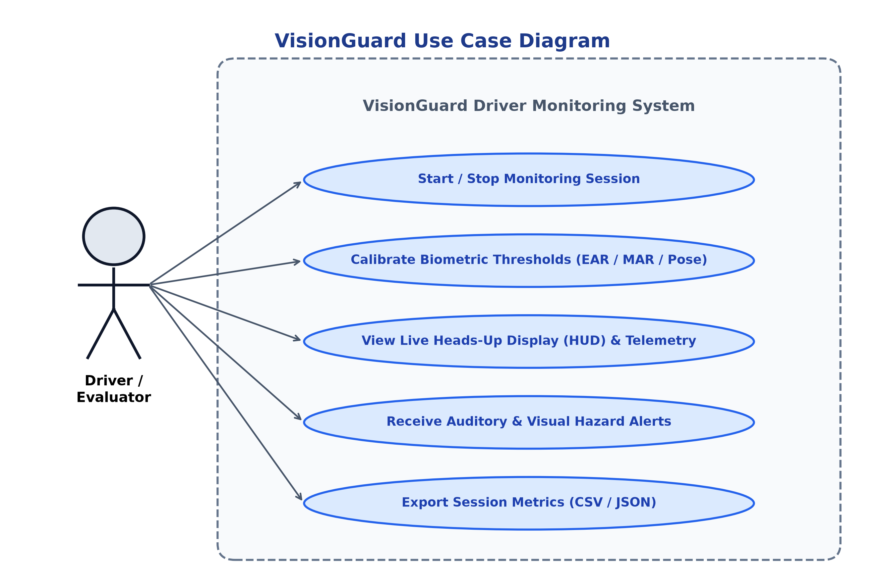

### Class / Component Diagram
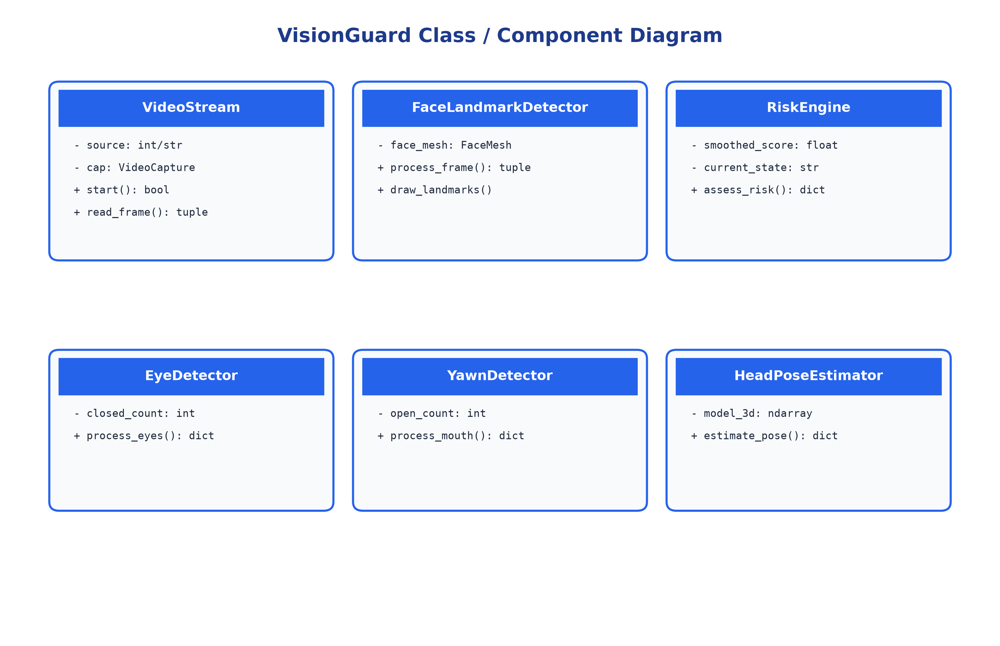

### Sequence Diagram
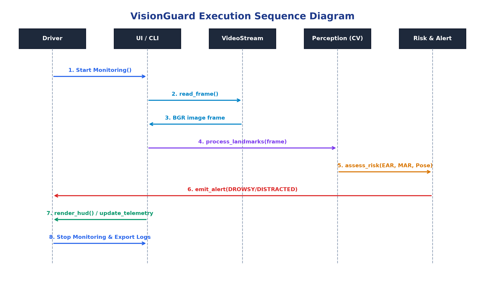

### Architecture Diagram
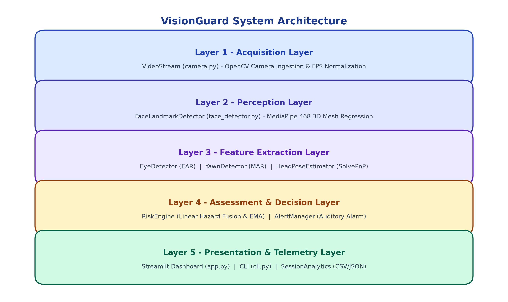

### Telemetry ER Diagram
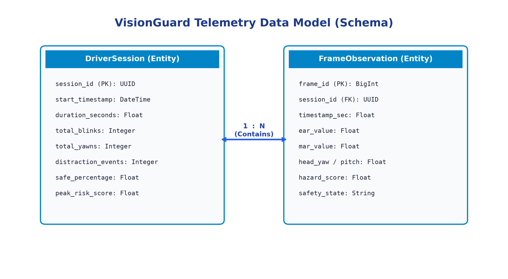

### Process Flow Diagram
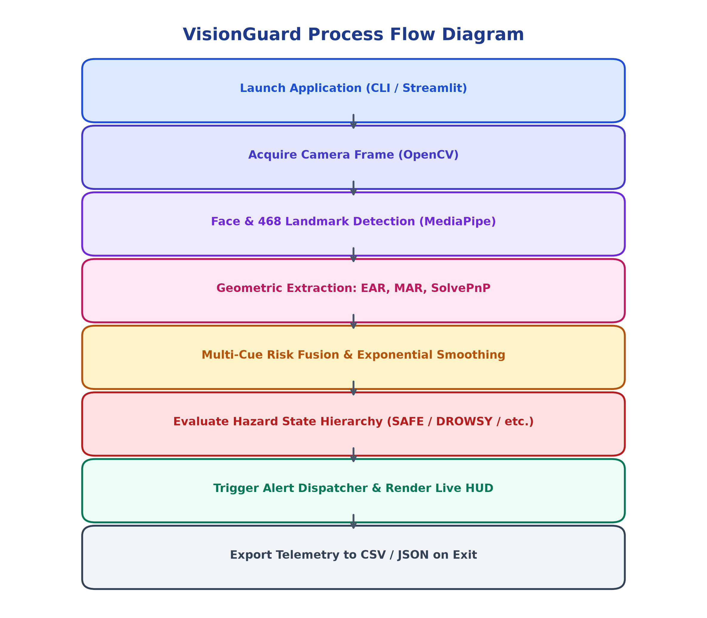

---

## Screenshots

### Live Monitoring (SAFE State)
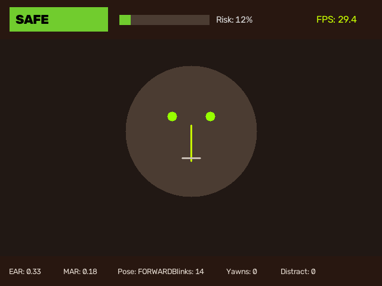

### Prolonged Eye Closure (DROWSY State)
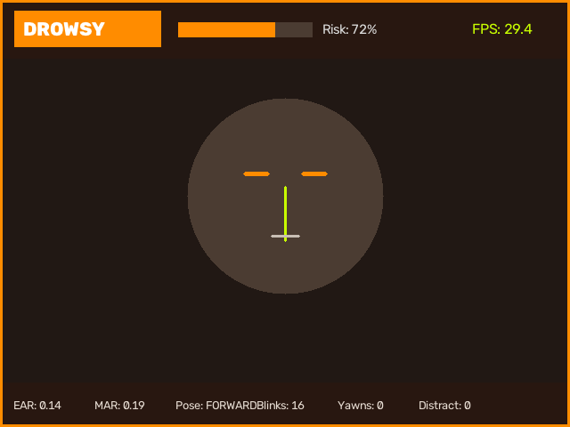

### Head Turn Distraction (DISTRACTED State)
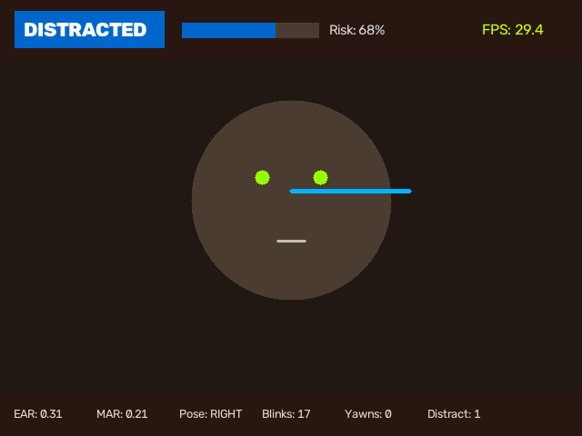

### Yawn Detection (CAUTION State)
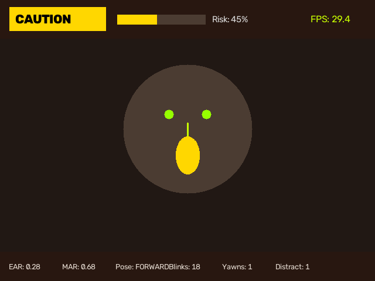

### Compound Fatigue (HIGH RISK State)
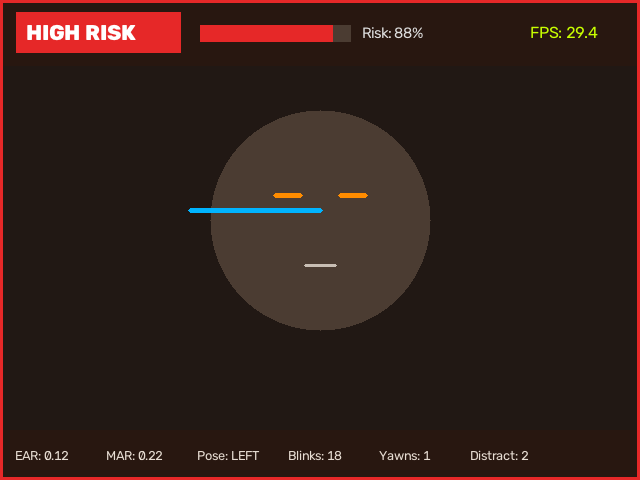

---

## Non-Functional Requirements

- **Performance (NFR-1)**: End-to-end frame processing latency under 35ms ($\approx 28-30$ FPS) on consumer laptop CPUs without GPU acceleration.
- **Usability (NFR-2)**: Single-command startup (`python3 main.py`) with responsive visual display and intuitive controls.
- **Reliability (NFR-3)**: Complete fault-tolerance for camera disconnections, lighting dropouts, and facial occlusions.
- **Maintainability (NFR-4)**: Strict PEP-8 compliance, modular architecture, comprehensive docstrings, and zero unexplained magic numbers.
- **Resource Efficiency (NFR-5)**: Lightweight memory footprint under 320 MB and CPU utilization under 15%.
- **Privacy & Portability (NFR-6)**: 100% on-device volatile processing with cross-platform support across macOS, Linux, and Windows.

---

## Testing

Run the automated test suite with Pytest:

```bash
python3 -m pytest tests/ -v
```
**Test Results: 17 Passed, 0 Failed (100% Pass Rate)**
- Geometric Euclidean distance invariants & division-by-zero protection
- EAR calculation under open/closed eye synthetic geometries
- MAR calculation & temporal speech suppression
- 3D SolvePnP pose estimation and Euler angle extraction
- Multi-cue Risk Engine transitions (`SAFE` $\to$ `DROWSY` $\to$ `DISTRACTED` $\to$ `HIGH RISK`)
- Telemetry aggregation, KPI computation, and CSV/JSON disk export

---

## Author

**Yash Goyal**  
Registration Number: 24BAI10100  
Course: B.Tech (Computer Vision / Applied AI)  
Institution: Vellore Institute of Technology (VIT)  
Academic Session: 2025 – 2026  
VITyarthi - Build Your Own Project Evaluation  
License: [MIT](LICENSE)
