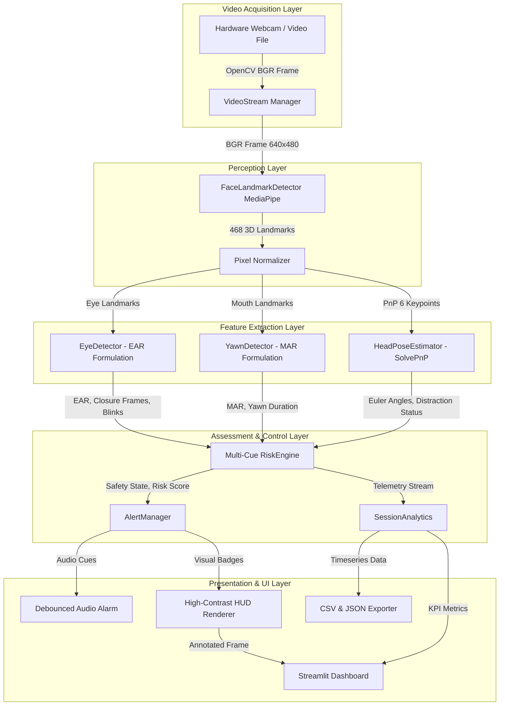
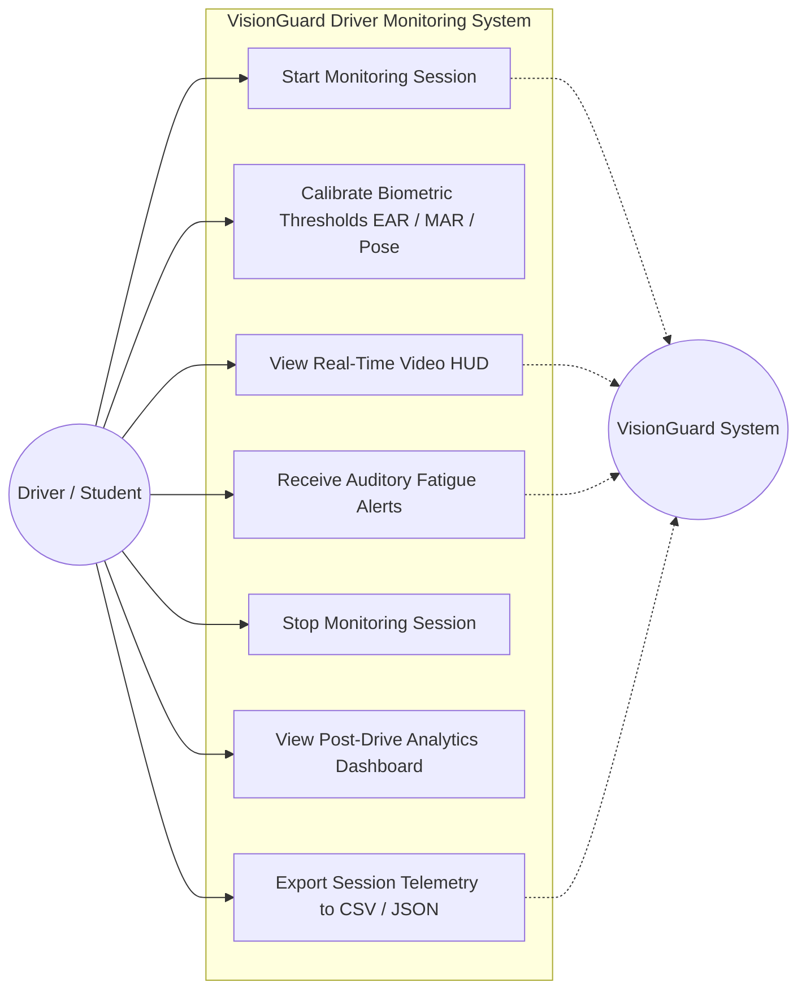
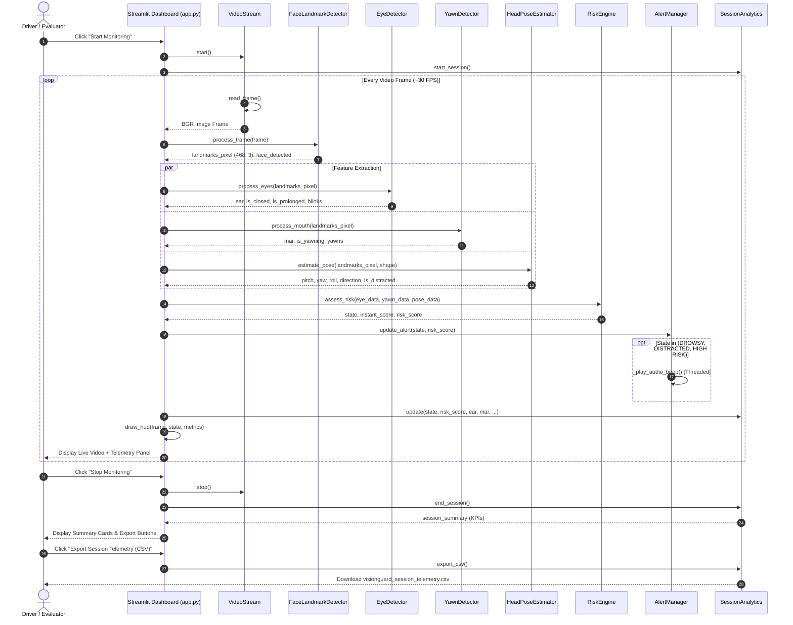
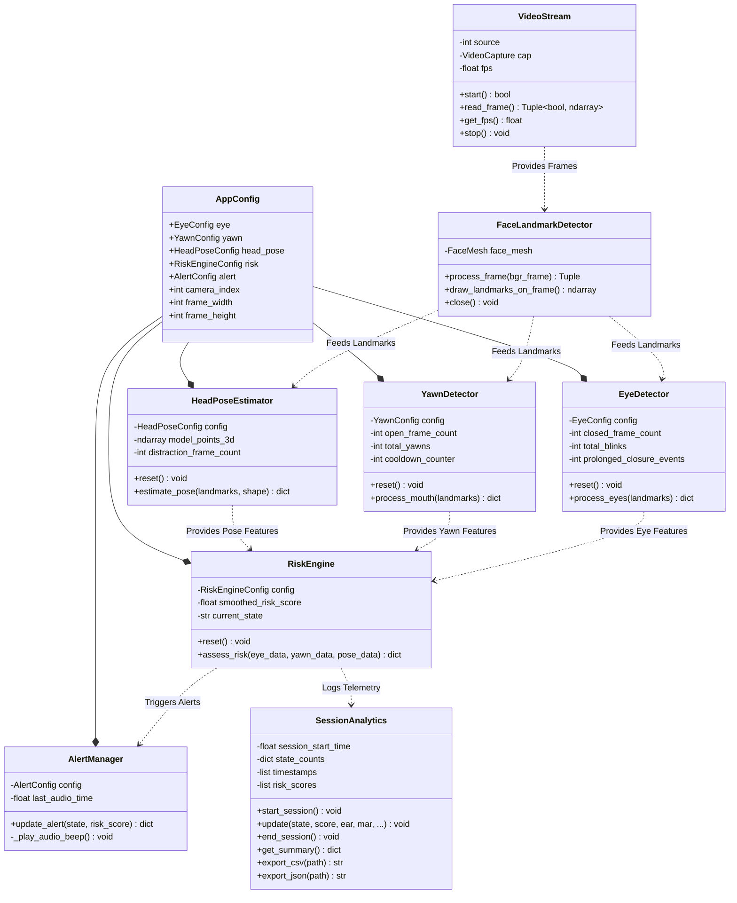

# VisionGuard – System Diagrams Specification

This document presents the complete architectural, process, UML, and data flow diagrams for the VisionGuard Driver Drowsiness and Distraction Detection System.

---

## 1. System Architecture Diagram



---

## 2. Process Flow / Workflow Diagram

```mermaid
flowchart TD
    START([Start System]) --> INIT[Initialize MediaPipe, OpenCV & Config]
    INIT --> CAPTURE[Capture Next Video Frame]
    CAPTURE --> CHECK_FRAME{Frame Valid?}
    CHECK_FRAME -- No --> RECONNECT[Attempt Camera Reconnect / Terminate]
    CHECK_FRAME -- Yes --> DETECT_FACE[Run MediaPipe Face Mesh]
    
    DETECT_FACE --> FACE_FOUND{Face Detected?}
    FACE_FOUND -- No --> SET_NO_FACE[Set State = NO FACE] --> RENDER_HUD
    
    FACE_FOUND -- Yes --> EXTRACT[Extract 468 Dense Landmarks]
    
    EXTRACT --> CALC_EAR[Compute Eye Aspect Ratio EAR]
    EXTRACT --> CALC_MAR[Compute Mouth Aspect Ratio MAR]
    EXTRACT --> SOLVE_PNP[Solve 3D Perspective-n-Point]
    
    CALC_EAR --> EVAL_EYES{EAR < 0.22?}
    EVAL_EYES -- Yes --> INC_EYE_CNT[Increment Closed Frame Counter]
    EVAL_EYES -- No --> CHECK_BLINK{1 <= Frames <= 4?}
    CHECK_BLINK -- Yes --> INC_BLINK[Blink Count + 1]
    CHECK_BLINK -- No --> RESET_EYE_CNT[Reset Counter]
    
    INC_EYE_CNT --> CHECK_PROLONGED{Closed Frames >= 15?}
    CHECK_PROLONGED -- Yes --> FLAG_DROWSY[Set Flag: Prolonged Eye Closure]
    CHECK_PROLONGED -- No --> CALC_RISK
    
    CALC_MAR --> EVAL_MOUTH{MAR >= 0.60?}
    EVAL_MOUTH -- Yes --> INC_YAWN_CNT[Increment Mouth Open Counter]
    EVAL_MOUTH -- No --> RESET_YAWN[Reset Mouth Counter]
    INC_YAWN_CNT --> CHECK_YAWN{Open Frames >= 15?}
    CHECK_YAWN -- Yes --> FLAG_YAWN[Set Flag: Confirmed Yawn]
    CHECK_YAWN -- No --> CALC_RISK
    
    SOLVE_PNP --> CALC_EULER[Decompose Rotation Matrix to Pitch/Yaw/Roll]
    CALC_EULER --> CHECK_POSE{|Yaw| > 25° or |Pitch| > 20°?}
    CHECK_POSE -- Yes --> INC_POSE_CNT[Increment Distraction Counter]
    CHECK_POSE -- No --> RESET_POSE[Reset Distraction Counter]
    INC_POSE_CNT --> CHECK_DISTRACT{Distract Frames >= 20?}
    CHECK_DISTRACT -- Yes --> FLAG_DISTRACT[Set Flag: Driver Distracted]
    CHECK_DISTRACT -- No --> CALC_RISK
    
    FLAG_DROWSY --> CALC_RISK[Calculate Instantaneous & Smoothed Risk Score]
    FLAG_YAWN --> CALC_RISK
    FLAG_DISTRACT --> CALC_RISK
    RESET_EYE_CNT --> CALC_RISK
    RESET_YAWN --> CALC_RISK
    RESET_POSE --> CALC_RISK
    
    CALC_RISK --> CLASSIFY_STATE{Evaluate State Hierarchy}
    CLASSIFY_STATE -->|Drowsy + Distracted| ST_HIGH[HIGH RISK]
    CLASSIFY_STATE -->|Prolonged Eye Closure| ST_DROWSY[DROWSY]
    CLASSIFY_STATE -->|Head Turned Away| ST_DISTRACT[DISTRACTED]
    CLASSIFY_STATE -->|Yawning / Moderate Risk| ST_CAUTION[CAUTION]
    CLASSIFY_STATE -->|Nominal Biometrics| ST_SAFE[SAFE]
    
    ST_HIGH --> DISPATCH_ALERT[Dispatch Visual & Auditory Cues]
    ST_DROWSY --> DISPATCH_ALERT
    ST_DISTRACT --> DISPATCH_ALERT
    ST_CAUTION --> DISPATCH_ALERT
    ST_SAFE --> DISPATCH_ALERT
    
    DISPATCH_ALERT --> UPDATE_STATS[Update Session Telemetry & Timeseries]
    UPDATE_STATS --> RENDER_HUD[Draw High-Contrast HUD on Frame]
    RENDER_HUD --> DISPLAY[Render in Streamlit Dashboard]
    DISPLAY --> CHECK_STOP{User Clicked Stop?}
    CHECK_STOP -- No --> CAPTURE
    CHECK_STOP -- Yes --> EXPORT_REPORT[Export CSV/JSON Session Analytics]
    EXPORT_REPORT --> END([End Monitoring])
```

---

## 3. UML Use Case Diagram



---

## 4. UML Sequence Diagram



---

## 5. UML Class / Component Diagram


